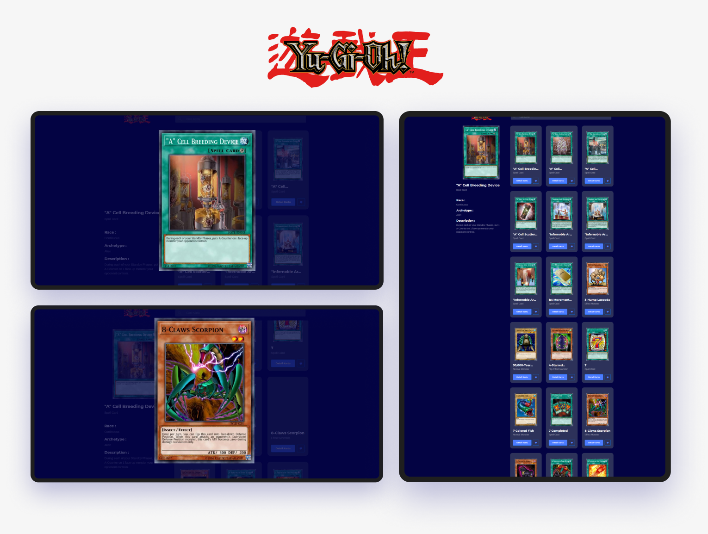
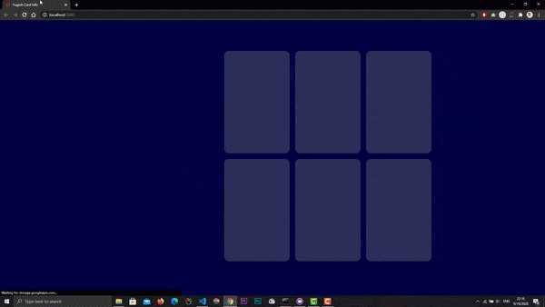
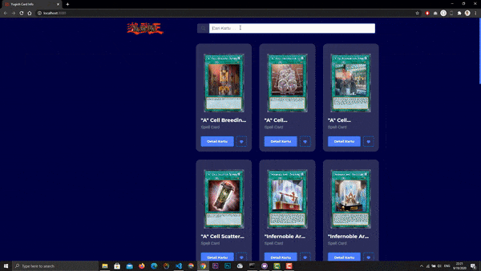

 

# Yu-Gi-Oh! Card Info V1
An Web application to displays the name - card name Yu-Gi-Oh! along with the information  
dcreated using reactjs and the data source comes from [API](https://db.ygoprodeck.com/) 
this is my first application to use reactJS
 
   
   
 
 
## NOTES
 **Do not publish this apps without my permission or try to claim this apps is yours!!!**  
 **that will broke my heart :(**

## Table of Contents
* [Features](#features)
* [Screenshoots](#screenshoots)
* [Authors](#authors)
* [Contributors](#contibutors)
* [License](#license)
* [Acknowledgments](#acknowledgments)

## Features
Here's the the features of this apps :
- [x] Zoom Image
- [x] Skeleton Loading
- [x] Infinite Scroll ( With Button )
- [x] Search Card
- [x] Easter Egg ( Find It ! )

## Screenshoots
here's the screenshoot of the apps that I made, hope you like it

**Home Page :**  
 

**Easter Egg :**  
 

## Authors
* **Rizky Bayu Oktavian** - *Author* - [@rbayuokt](https://www.instagram.com/rbayuokt/)

## Contibutors
* **Nenza Nurfirmansyah** - *Contributor* - [nenzan](https://github.com/nenzan)

## License
This project is licensed under the MIT License - see the [LICENSE.md](LICENSE) file for details

## Acknowledgments
* Hat tip to anyone whose code was used
* Inspiration
* etc
